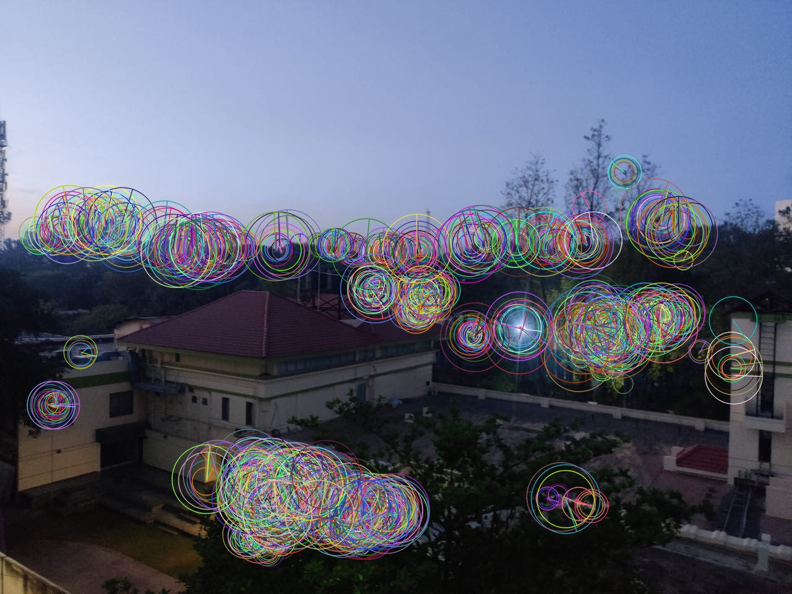
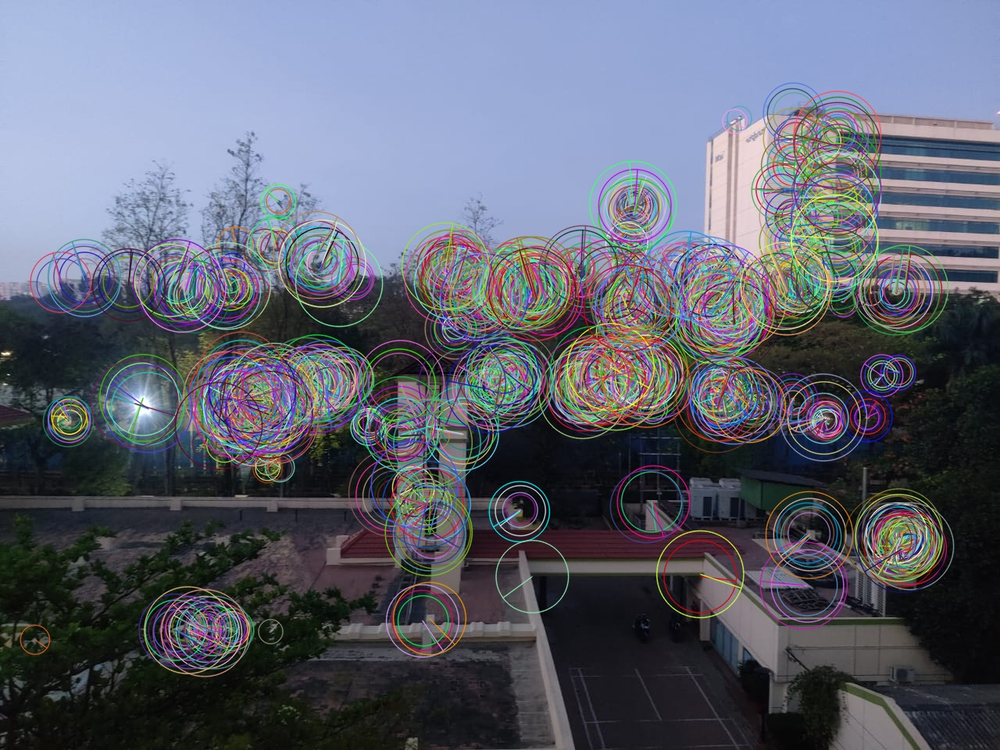
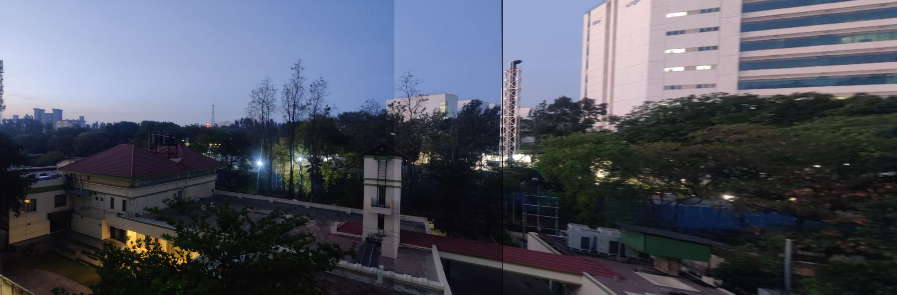
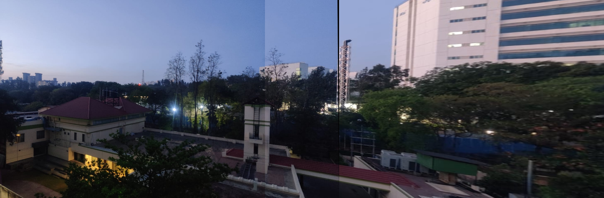

# VR_Assignment1_Sarvesh_IMT2022521

This repository contains a computer vision assignment implemented in Python. It covers coin detection, segmentation, coin counting, and panorama creation. Detailed instructions, methodology, results, and observations are provided below. The solution is available as both Python scripts and Jupyter notebooks.

---

## Table of Contents

- [Running the Code](#running-the-code)
- [Project Documentation](#project-documentation)
- [Part A: Coin Detection, Segmentation & Counting](#part-a-coin-detection-segmentation--counting)
- [Part B: Panorama Creation](#part-b-panorama-creation)
- [Final Report and Conclusions](#final-report-and-conclusions)

---

## Running the Code

To ensure a smooth execution of the code, it is recommended to use a virtual environment to manage dependencies.

### **1. Setting Up a Virtual Environment**

#### **Windows**
```sh
python -m venv venv
venv\Scripts\activate
```

#### **macOS/Linux**
```sh
python3 -m venv venv
source venv/bin/activate
```

### **2. Installing Dependencies**
Once the virtual environment is activated, install the required dependencies from `requirements.txt`:
```sh
pip install -r requirements.txt
```

### **3. Running the Code**

#### **Via Command Line:**

- **For coin detection, segmentation, and counting:**
  ```sh
  python Coins.py
  ```

- **For panorama creation:**
  ```sh
  python Panorama.py
  ```

#### **Via Jupyter Notebooks:**

- Activate the virtual environment (if not already activated) and launch Jupyter Notebook:
  ```sh
  jupyter notebook
  ```

- Open and run the individual notebooks:
  - [Part1-coins.ipynb](http://_vscodecontentref_/0)
  - [Part2-Panorama.ipynb](http://_vscodecontentref_/1)

---

Ensure all dependencies are installed correctly before running the scripts. If you encounter any issues, verify that your virtual environment is activated and that all packages are installed properly.


---

## Project Documentation

This repository is self-contained and runs without additional intervention. All dependencies are listed in the [requirements.txt](http://_vscodecontentref_/2) file. Detailed documentation is provided below, and all visual outputs—such as detection, segmentation, coin counts, and panoramas—are clearly labeled.

---

## Part A: Coin Detection, Segmentation & Counting

### Dataset Location  
The coin images are located in the `Inputs/Part-1` folder.

- **img1.jpg:**  
  This is the base image used for coin detection and segmentation.

- **img2.jpg:**  
  This image is derived from img1 by rotating it 90 degrees and slightly elongating the scene. Additionally, img2 contains 2 extra coins.

- **img3.jpg:**  
  This image is similar to img1 but features a slight rotation and a subtle change in the background.

### Processing and Methods

#### 1. Preprocessing

##### Grayscale, HSV and Lab Conversion
To improve the robustness of the coin detection process, the input images were converted into three different color spaces:  

- **Grayscale:** Simplifies processing by focusing on intensity variations.  
- **HSV (Hue, Saturation, Value):** Helps in distinguishing objects based on color and intensity variations.  
- **Lab (Lightness, a, b):** Designed to approximate human vision and enhance contrast between objects and background.  

The subsequent blurring and edge detection operations were applied separately to each of these color spaces.

##### Noise Reduction
To reduce noise and avoid false edge detection, Gaussian and Median blurs are applied:

- **Gaussian Blur:**  
  - Applied with a kernel size of (5,5).  
  - Helps smooth the image by averaging pixel values with a Gaussian kernel, effectively reducing high-frequency noise.  

- **Median Blur:**  
  - Applied with a kernel size of 5.  
  - Replaces each pixel's value with the median of the intensities in its neighborhood, which is particularly effective in removing salt-and-pepper noise.  

After testing both methods, it was observed that the **Median Blur did not produce satisfactory results**, often leading to loss of finer edge details and incomplete contour detection. As a result, **Gaussian Blur was used exclusively for all images** to ensure better edge clarity and reliable segmentation.

---

#### 2. Edge Detection

To identify coin boundaries effectively, multiple edge detection techniques were explored across different color spaces (Grayscale, HSV, and Lab). 

##### Methods Tried

- **Sobel Operator:**  
  - Computes the gradient magnitude in both horizontal and vertical directions.  
  - Detects edges but is sensitive to noise and may produce thicker edges.  

- **Laplacian of Gaussian (LoG) / Marr-Hildreth:**  
  - Applies a Gaussian blur followed by the Laplacian operator to detect edges.  
  - Enhances regions with rapid intensity change but can be sensitive to noise.  

- **Canny Edge Detector:**  
  - A multi-stage algorithm including noise reduction, gradient calculation, non-maximum suppression, and edge tracking by hysteresis.  
  - Known for its ability to detect true weak edges and produce thin, well-defined edges.  

- **Roberts Cross Operator:**  
  - One of the simplest edge detection methods that computes gradient magnitude using a 2×2 convolution kernel.  
  - Works well for high-contrast images but is very sensitive to noise.  

- **Prewitt Operator:**  
  - Similar to Sobel but uses fixed convolution kernels rather than weighting towards the center.  
  - Less effective than Sobel for detecting edges in noisy images.

The results from each **color space (Grayscale, HSV, Lab)** and **edge detection method** are saved in the **`Outputs/Part1/`** folder.  
Each image is **clearly labeled** to indicate the color space and edge detection technique used. 


---

### 3.Threshold Selection for Edge Detector Methods

Below are the thresholds used in the code for each edge detection method, along with a brief description for each:

1. **Canny Edge Detector:**  
   - **Threshold Values:** Low = 50, High = 150  
   - **Description:**  
     The Canny detector uses two thresholds where the lower threshold (50) suppresses weak edges, and the higher threshold (150) retains only strong edges. This dual thresholding helps in accurate edge tracking while minimizing noise.

2. **Laplacian of Gaussian (Marr-Hildreth):**  
   - **Threshold Value:** `int(0.1 * np.max(log_abs))`  
   - **Description:**  
     An adaptive threshold is calculated as 10% of the maximum value from the absolute Laplacian response. This adapts to image contrast by ensuring only significant changes (edges) are detected.

3. **Sobel Edge Detector:**  
   - **Threshold Value:** 50  
   - **Description:**  
     A fixed threshold of 50 is applied to the magnitude of the Sobel gradients. This value was chosen to balance sensitivity to genuine edges with the suppression of noise artifacts.

4. **Roberts Cross Operator:**  
   - **Threshold Value:** 10  
   - **Description:**  
     Due to the simplicity and high sensitivity of the Roberts operator, a lower threshold (10) is used. This ensures that only pronounced edge responses are captured, reducing the number of false detections in noisy areas.

5. **Prewitt Operator:**  
   - **Threshold Value:** 50  
   - **Description:**  
     Like the Sobel operator, the Prewitt operator uses a threshold of 50 to convert the gradient magnitude into a binary edge map, ensuring that less significant gradients (likely due to noise) are discarded.

These thresholds were chosen based on empirical observations to balance sensitivity and specificity, ensuring that true edges are detected without excessive noise.

---

#### 4. Contour Detection and Filtering

Once the binary edge map is produced, the next step is to extract contours. Each contour is essentially a curve joining all the continuous points along the edge (having same intensity) that represent boundaries of potential objects—in our case, coins.

**Finding Contours:**

- The code uses OpenCV's `findContours` function to traverse the binary edge map.
- This function collects all the connected components (contours) where the pixel intensity is non-zero.
- Each detected contour is a series of coordinates outlining a possible coin boundary.

**Filtering Contours:**

Not every detected contour corresponds to an actual coin. Many may be the result of noise, small irrelevant details, or incomplete edges. To filter these out, two main criteria are applied:

1. **Area Filtering:**
   - A minimum area threshold (for example, 500) is used.
   - Contours with an area smaller than this threshold are discarded because they are unlikely to be coins.
   - This helps prevent tiny, spurious detections from being misinterpreted as coins.

2. **Circularity Filtering:**
   - Coins are typically near-circular. Circularity is a metric defined as:
     
     ß
     Circularity = (4 × π × Area) / (Perimeter²)
     
     A perfect circle has a circularity of 1, while other shapes have lower values.
   - By computing the perimeter (arc length) of the contour and using the above formula, contours that are too far from circular (falling below an empirically chosen circularity threshold, e.g., 0.7) can be removed.
   - Although in some parts of the code this circularity check is commented out, it is an optional but useful step when noise or non-circular objects can confuse the detection.

**Overall Benefit:**

- Filtering on area removes small artifacts and noise.
- Filtering on circularity further refines the results by ensuring that only contours with a shape resembling a coin (nearly circular) are retained.
- The combination of these checks significantly reduces false positives, ensuring that subsequent steps such as segmentation and counting operate on contours that are most likely actual coins.

This careful contour detection and filtering process is critical for improving the accuracy of coin segmentation and counts in the overall pipeline.

---

#### 5. Counting and Annotation

##### Counting Coins
The number of filtered contours corresponds to the number of detected coins.

##### Annotation
The original image is annotated with the detected coin boundaries and the total count, providing a visual representation of the results.


### Output

- Results are saved under the [Outputs/Part1](http://_vscodecontentref_/4) directory:
  - Images highlight detected coin contours.
  - Segmented coin images are provided.
  - Overlays display the coin count on the images.

#### Input Image


#### Canny Edge Detection in Grayscale


#### Coin Contours


#### Coin Count Annotation


#### Sample Segmented Coins


### Observations

By fine-tuning the thresholds for each edge detection method, the coin detection process consistently identified the same number of coins across images. However, a detailed examination of the segmented outputs revealed that the Canny Edge Detector provided the most accurate and complete coin segmentation. Additionally, it was observed that images processed in Lab and Grayscale color spaces produced comparably better results than those processed in the HSV color space.


---

## Part B: Panorama Creation

### Dataset Location  
The coin images are located in the `Inputs/Part-2` folder.

- **Image-3.jpg:**  


- **Image-4.jpg:**  


- **Image-6.jpg:**  


### Processing and Methods

- **Feature Detection & Matching:**  
  The code first extracts keypoints and computes descriptors for each input image using SIFT and ORB. A brute-force matcher then compares these descriptors between consecutive images. For ORB, the Hamming distance is used; for SIFT, the L2 norm is employed. A ratio test is applied to keep only the most reliable matches, which form the basis for computing the homographies.

- **Image Stitching:**  
  Using the set of reliable matches, homographies are computed between consecutive image pairs with the RANSAC algorithm. These homographies are combined cumulatively to warp each subsequent image into the coordinate system of the first image. Two stitching approaches are implemented:
  
  - **Basic Stitching:**  
    In this approach, images are warped according to the cumulative homography and directly overlaid onto a common canvas. After each new image is added, the resulting panorama is cropped to remove black borders. However, this method may produce visible straight seams or hard boundaries between images.
  
  - **Feather Blending:**  
    To eliminate the harsh transitions seen in basic stitching, a feather blending technique is applied to the overlapping regions between images. Feather blending calculates a weighted average (using an alpha factor that tapers near the edge) for the overlapping pixels, thereby smoothing the transition and removing the straight lines or abrupt seams. This results in a more seamless and visually pleasing panorama.

- **Cropping:**  
  Once the images are stitched together—either with basic stitching or feather blending—the panorama may contain black, empty regions due to perspective warping. The code automatically detects and crops these areas by thresholding the panorama and finding the bounding rectangle surrounding all non-black pixels.

In summary, the `Panorama.py` file implements these steps to create a final stitched panorama. Initially, the basic stitching approach was used but produced unsightly straight lines between images. The integration of feather blending remedied this issue, ensuring smooth transitions across overlapping areas and significantly enhancing the visual quality of the final panorama.

### Output

- The final panoramic images are stored in the [Outputs/Part2](http://_vscodecontentref_/6) directory:
  - Displays include keypoint visualizations.
  - Both basic and feather-blended panoramas are generated for both the methods (SIFT and ORB).


#### Feature Extractions with SIFT


#### Feature Extractions with ORB




#### Paroma with SIFT 


#### Paroma with ORB 


#### Paroma with SIFT + Feather Blend


#### Paroma with ORB + Feather Blend 


### Observations

- Detailed analysis is provided for keypoint matching and panorama quality.
- Visual comparisons demonstrate the benefits of feather blending over the basic method.
- SIFT method utilizes more points compared to ORB

---

## Final Report and Conclusions

### Approaches and Methodology

- **Coin Detection & Segmentation:**  
  Several edge detection and segmentation methodologies were tested and refined to achieve optimal coin extraction.
  
- **Panorama Creation:**  
  Multiple panorama stitching techniques were evaluated. Feather blending emerged as a superior method for creating seamless panoramas.

### Results

- Both script-based and notebook-based implementations run autonomously without further intervention.
- The performance of each module is validated by the accuracy of coin counts and the visual quality of panoramas.
  
  
- **Challenges:**  
  Fine-tuning parameters for various methods required iterative testing, and handling a range of image qualities posed challenges.
  
- **Final Approach:**  
  The implementations in [Coins.py](http://_vscodecontentref_/7) and [Panorama.py](http://_vscodecontentref_/8) represent balanced solutions for stability and performance. Jupyter notebooks further facilitate interactive testing and validation.

---

This README file provides comprehensive guidance on how to run the project, understand the processing methods employed, and review the results. All visual outputs are well documented, ensuring clarity in the process and outcomes.

For further details, please refer to inline comments in the source code and the accompanying Jupyter notebooks.